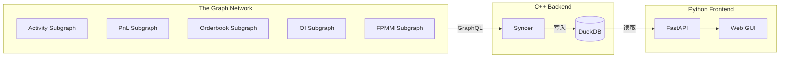
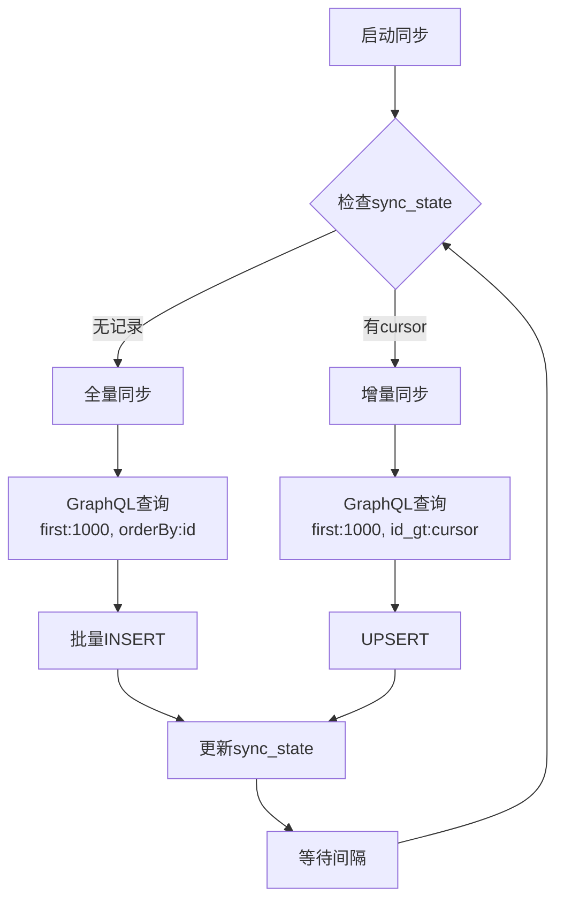

# Polymarket 数据同步系统

## 架构




## 已确认的 Subgraph ID


| Subgraph      | ID                                             | Entity                                      |
| ------------- | ---------------------------------------------- | ------------------------------------------- |
| Activity      | `Bx1W4S7kDVxs9gC3s2G6DS8kdNBJNVhMviCtin2DiBp`  | Split, Merge, Redemption, NegRiskConversion |
| PnL           | `6c58N5U4MtQE2Y8njfVrrAfRykzfqajMGeTMEvMmskVz` | UserPosition, NegRiskEvent, Condition       |
| Orderbook     | `7fu2DWYK93ePfzB24c2wrP94S3x4LGHUrQxphhoEypyY` | OrderFilledEvent, Orderbook                 |
| Open Interest | `ELaW6RtkbmYNmMMU6hEPsghG9Ko3EXSmiRkH855M4qfF` | MarketOpenInterest, GlobalOpenInterest      |
| FPMM          | `81Dm16JjuFSrqz813HysXoUPvzTwE7fsfPk2RTf66nyC` | FixedProductMarketMaker, FpmmTransaction    |


> 注：positions、resolution、wallet 等 subgraph 需要用户从 The Graph Explorer 页面手动获取 ID，或自行部署

## 目录结构

```
poly/
├── run.py                  # 一键启动脚本
├── config.json             # 配置文件 (API_KEY 等)
├── syncer/                 # C++ 后端
│   ├── CMakeLists.txt
│   ├── src/
│   │   ├── main.cpp
│   │   ├── config.hpp      # 配置加载
│   │   ├── http_client.hpp # libcurl 封装
│   │   ├── graphql.hpp     # GraphQL 查询构建
│   │   ├── schema.hpp      # Entity 结构定义
│   │   ├── syncer.hpp      # 同步逻辑
│   │   └── db.hpp          # DuckDB 操作
│   └── deps/               # 第三方依赖
├── frontend/               # Python 前端
│   ├── main.py             # FastAPI 入口
│   ├── templates/          # HTML 模板
│   └── requirements.txt
└── data/
    └── polymarket.duckdb   # 数据文件
```

## C++ 后端核心设计

### 依赖

- libcurl (HTTP)
- nlohmann/json (JSON 解析)
- duckdb (数据库)

### 同步策略




### DuckDB Schema 示例

```sql
-- 同步状态表
CREATE TABLE sync_state (
    subgraph_id VARCHAR PRIMARY KEY,
    entity_name VARCHAR,
    last_id VARCHAR,
    last_sync_at TIMESTAMP
);

-- OrderFilledEvent 表
CREATE TABLE order_filled_event (
    id VARCHAR PRIMARY KEY,
    transaction_hash VARCHAR,
    timestamp BIGINT,
    order_hash VARCHAR,
    maker VARCHAR,
    taker VARCHAR,
    maker_asset_id VARCHAR,
    taker_asset_id VARCHAR,
    maker_amount_filled HUGEINT,
    taker_amount_filled HUGEINT,
    fee HUGEINT
);
```

### 最优 Bulk Dump 策略

**Entity ID 结构（基于 subgraph 源码）：**


| Entity                 | ID 格式              | 来源                   |
| ---------------------- | ------------------ | -------------------- |
| Split/Merge/Redemption | `txHash_logIndex`  | `getEventKey(event)` |
| OrderFilledEvent       | `txHash_orderHash` | 复合键                  |
| Condition              | `conditionId`      | bytes32              |
| UserPosition           | `user_tokenId`     | 复合键                  |


**ID 天然有序**（基于区块/交易顺序），The Graph 底层 PostgreSQL 对 id 有 B-tree 索引。

**最优查询模式：**

```graphql
{
  splits(
    first: 1000,              # The Graph 单次最大限制
    orderBy: id,              # 用 id 排序
    orderDirection: asc,
    where: { id_gt: "cursor" } # 游标分页，走 B-tree 索引
  ) {
    id
    timestamp
    stakeholder
    condition
    amount
  }
}
```

**为什么不用 skip：**

- `skip: 100000` 会扫描前 10 万条记录，容易超时
- `id_gt` 是 Index Scan，O(log N) 定位

**C++ 实现：**

```cpp
std::string build_query(const std::string& entity, 
                        const std::string& cursor, 
                        int limit = 1000) {
    return fmt::format(R"({{
        {}(first: {}, orderBy: id, orderDirection: asc, 
           where: {{ id_gt: "{}" }}) {{
            id
            ... // 其他字段
        }}
    }})", entity, limit, cursor);
}

// 同步循环
void sync_entity(const std::string& entity) {
    std::string cursor = load_cursor(entity);  // 从 sync_state 表加载
    std::vector<Row> buffer;
    
    while (true) {
        auto results = http_post(build_query(entity, cursor));
        if (results.empty()) break;
        
        buffer.insert(buffer.end(), results.begin(), results.end());
        cursor = results.back().id;
        
        if (buffer.size() >= 10000) {
            batch_insert(entity, buffer);
            buffer.clear();
            save_cursor(entity, cursor);
        }
    }
    
    if (!buffer.empty()) {
        batch_insert(entity, buffer);
        save_cursor(entity, cursor);
    }
}
```

## Python 前端

### FastAPI 端点

- `GET /` - Web GUI 主页
- `GET /api/positions?user=0x...` - 查询用户持仓
- `GET /api/orders?maker=0x...` - 查询订单
- `GET /api/stats` - 全局统计

### 简单 HTML 筛选界面

- 按用户地址筛选
- 按时间范围筛选
- 按 tokenId/conditionId 筛选

## 一键启动 (run.py)

```bash
python run.py
```

**run.py 功能：**

```python
# run.py
import subprocess, webbrowser, time, os

def main():
    # 1. 编译 C++ syncer（如果需要）
    if need_rebuild():
        os.makedirs("syncer/build", exist_ok=True)
        subprocess.run(["cmake", ".."], cwd="syncer/build")
        subprocess.run(["cmake", "--build", "."], cwd="syncer/build")
    
    # 2. 启动 C++ syncer（后台）
    syncer = subprocess.Popen(["syncer/build/syncer", "--config", "config.json"])
    
    # 3. 启动 Python frontend（后台）
    frontend = subprocess.Popen(["uvicorn", "main:app", "--port", "8000"], cwd="frontend")
    
    # 4. 等待服务就绪，打开浏览器
    time.sleep(2)
    webbrowser.open("http://localhost:8000")
    
    # 5. 等待 Ctrl+C 退出
    try:
        syncer.wait()
    except KeyboardInterrupt:
        syncer.terminate()
        frontend.terminate()
```

**手动运行方式（备用）：**

```bash
# 编译 C++ syncer
cd syncer && mkdir build && cd build
cmake .. && make

# 运行同步（需配置 API_KEY）
./syncer --config config.json

# 启动前端
cd frontend
pip install -r requirements.txt
uvicorn main:app --reload
```

## 配置文件 (config.json)

```json
{
  "api_key": "YOUR_THE_GRAPH_API_KEY",
  "db_path": "data/polymarket.duckdb",
  "sync_interval_seconds": 60,
  "subgraphs": [
    {
      "id": "Bx1W4S7kDVxs9gC3s2G6DS8kdNBJNVhMviCtin2DiBp",
      "name": "activity",
      "entities": ["Split", "Merge", "Redemption", "NegRiskConversion"]
    },
    {
      "id": "6c58N5U4MtQE2Y8njfVrrAfRykzfqajMGeTMEvMmskVz",
      "name": "pnl",
      "entities": ["UserPosition", "NegRiskEvent", "Condition"]
    },
    {
      "id": "7fu2DWYK93ePfzB24c2wrP94S3x4LGHUrQxphhoEypyY",
      "name": "orderbook",
      "entities": ["OrderFilledEvent", "Orderbook", "MarketData"]
    },
    {
      "id": "ELaW6RtkbmYNmMMU6hEPsghG9Ko3EXSmiRkH855M4qfF",
      "name": "oi",
      "entities": ["MarketOpenInterest", "GlobalOpenInterest"]
    },
    {
      "id": "81Dm16JjuFSrqz813HysXoUPvzTwE7fsfPk2RTf66nyC",
      "name": "fpmm",
      "entities": ["FixedProductMarketMaker", "FpmmTransaction"]
    }
  ]
}
```

## 后期计划 (待实现)

> 以下功能在 sync 完成后实现，当前阶段只做数据同步和基础查询。

### 计算 Routine

sync 完成后，需要定期从头计算的指标：

- **用户 Performance 指标**：PnL、胜率、ROI、最大回撤
- **市场统计**：交易量、活跃用户数、持仓分布
- **排行榜**：按 PnL/交易量/胜率 排序

### 筛选规则

GUI 需要支持的筛选条件：

- 按用户地址
- 按时间范围
- 按 tokenId / conditionId
- 按 PnL 范围
- 按交易量阈值

### 定期刷新

- 计算任务定期触发（每小时/每天）
- 结果存入 DuckDB 的计算结果表
- GUI 从计算结果表读取，避免实时重算

