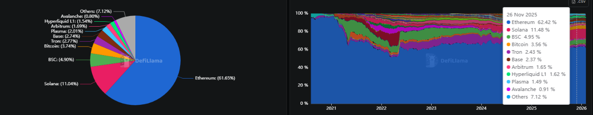
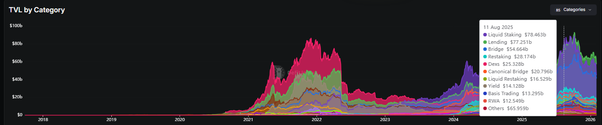

## Overview
- https://dune.com/datadashboards/prediction-markets
- https://defillama.com/protocols/prediction-market
- https://defillama.com/chains
- https://app.artemisanalytics.com/sectors
- https://defillama.com/categories

## TVL by Chains


## TVL by Categories


## 链上资产成分分解:
```
═══════════════════════════════════════════════════════════════════════════════
                        DeFi 资产锁定层级模型
═══════════════════════════════════════════════════════════════════════════════

  【自由态】                    
  ══════════                   ┌─────────────────────────────────────┐
                               │  Layer -1: 自由资产 (Free Assets)   │
                               │                                     │
                               │     ETH  BTC  USDC  ...             │
                               │                                     │
                               │  特征: 无合约约束，可自由转移       │
                               └──────────────┬──────────────────────┘
                                              │
                                              │ 资产进入合约 (存入)
                                              ▼
  【实体锁】                   ┌─────────────────────────────────────┐
  ══════════                   │  Layer 0: 原子锁定 (Atomic Lock)    │
   锁定的是                    │                                     │
   具体资产                    │  定义: 资产首次被合约托管           │
   本身                        │  性质: 每单位资产只能在一处         │
                               │        (互斥性 / partition)         │
                               │                                     │
                               │  例: Staking, LP存入, 借贷存款      │
                               └──────────────┬──────────────────────┘
                                              │
                                              │ 合约发放凭证 (mint)
                                              ▼
  【凭证锁】                   ┌─────────────────────────────────────┐
  ══════════                   │  Layer 1: 索取权 (Claim Token)      │
   锁定的是                    │                                     │
   对L0的                      │  定义: 代表L0资产的可转让凭证       │
   提取权                      │  性质: 与L0一一映射                 │
                               │        (但凭证可独立流通)           │
                               │                                     │
                               │  例: LST, LP Token, aToken          │
                               └──────────────┬──────────────────────┘
                                              │
                                              │ 凭证作为抵押品 (reuse)
                                              ▼
  【承诺锁】                   ┌─────────────────────────────────────┐
  ══════════                   │  Layer 2: 杠杆/复用 (Leverage)      │
   锁定的是                    │                                     │
   风险承诺                    │  定义: 用L1凭证再次获取敞口         │
   清算权                      │  性质: 纯粹的double-count           │
                               │        (同一底层资产被多重计算)     │
                               │                                     │
                               │  例: 抵押借贷, 递归LP, Restaking    │
                               └──────────────┬──────────────────────┘
                                              │
                                              │ 非经济约束 (governance)
                                              ▼
  【权利锁】                   ┌─────────────────────────────────────┐
  ══════════                   │  Layer 3: 治理/发行 (Rights Lock)   │
   锁定的是                    │                                     │
   发行权                      │  定义: 约束代币的释放或投票权       │
   治理权                      │  性质: 不对应实际锁定资产           │
                               │        (纯会计/治理层面)            │
                               │                                     │
                               │  例: Vesting, Gov Lock, Emission    │
                               └─────────────────────────────────────┘

```


| Layer  | 类别                    | 资产形态          | 锁定对象       | 锁定强度   | 经济功能      | Double Count | 操纵风险 | TVL计算     |
| ------ | ----------------------- | ----------------- | -------------- | ---------- | ------------- | ------------ | -------- | ----------- |
| **L0** | Native Staking          | ETH / SOL         | 底层资产本身   | 强         | 共识安全      | ❌            | ⭐ 低     | ✅ 必算      |
| **L0** | Liquid Staking（底层）  | ETH（已质押）     | 底层资产       | 强         | 共识安全      | ❌            | ⭐⭐ 中    | ✅ 必算      |
| **L0** | Supplied Assets         | 稳定币 / 蓝筹     | 真实资产       | 中         | 借贷供给      | ❌            | ⭐⭐ 中    | ✅ 必算      |
| **L0** | Pool1 LP                | 外部资产对        | 真实资产       | 中         | 交易流动性    | ❌            | ⭐⭐ 中    | ✅ 必算      |
| **L0** | Pool2 LP                | GovToken+外部     | 一半真实       | 中         | 流动性控制    | ❌            | ⭐⭐⭐⭐ 高  | ⚠️ 只算外部¹ |
| **L0** | Treasury（稳定币）      | USDC / DAI        | 真实资产       | 中         | 财政缓冲      | ❌            | ⭐⭐ 中    | ✅ 必算      |
| **L0** | Treasury（波动资产）    | ETH / GovToken    | 市场价值       | 中         | 储备          | ❌            | ⭐⭐⭐ 中   | ⚠️ 打折      |
| -----  | ----------------------- | ----------------- | -------------  | ------     | ------------  | ------------ | -------- | -------     |
| **L1** | LST (stETH/rETH)        | 索取权凭证        | 对L0的提取权   | 弱（可转） | DeFi抵押/杠杆 | ⚠️ 映射L0     | ⭐⭐⭐⭐ 高  | ⚠️ 条件算    |
| **L1** | LP Token                | 池份额凭证        | 对LP的提取权   | 弱（可转） | 可组合流动性  | ⚠️ 映射L0     | ⭐⭐⭐ 中   | ⚠️ 条件算    |
| **L1** | aToken / cToken         | 存款凭证          | 对存款的提取权 | 弱（可转） | 可组合借贷    | ⚠️ 映射L0     | ⭐⭐⭐ 中   | ⚠️ 条件算    |
| -----  | ----------------------- | ----------------- | -------------  | ------     | ------------  | ------------ | -------- | -------     |
| **L2** | Borrows（已借出）       | 借出资产          | 抵押品仍锁     | 中         | 杠杆/流动性   | ✅            | ⭐⭐⭐ 中   | ⚠️ Net=S-B²  |
| **L2** | Restaking（底层）       | 已质押 ETH        | 同一资产       | 强         | 复用安全      | ✅            | ⭐⭐⭐⭐ 高  | ❌ 不重复    |
| **L2** | Restaking（AVS 层）     | 再质押凭证        | 风险承诺       | 弱         | 安全背书      | ✅            | ⭐⭐⭐⭐⭐    | ❌ 不算      |
| **L2** | Recursive DeFi          | LP/LST/aToken     | 衍生资产       | 弱         | 杠杆放大      | ✅            | ⭐⭐⭐⭐⭐    | ❌ 不算      |
| -----  | ----------------------- | ----------------- | -------------  | ------     | ------------  | ------------ | -------- | -------     |
| **L3** | GovToken Lock           | 治理代币          | 内部会计价值   | 强         | 治理绑定      | ❌            | ⭐⭐⭐⭐⭐    | ❌ 不算      |
| **L3** | Vesting / Lockup        | 未解锁代币        | 未来发行权     | 强         | 激励管理      | ❌            | ⭐⭐⭐⭐⭐    | ❌ 不算      |
