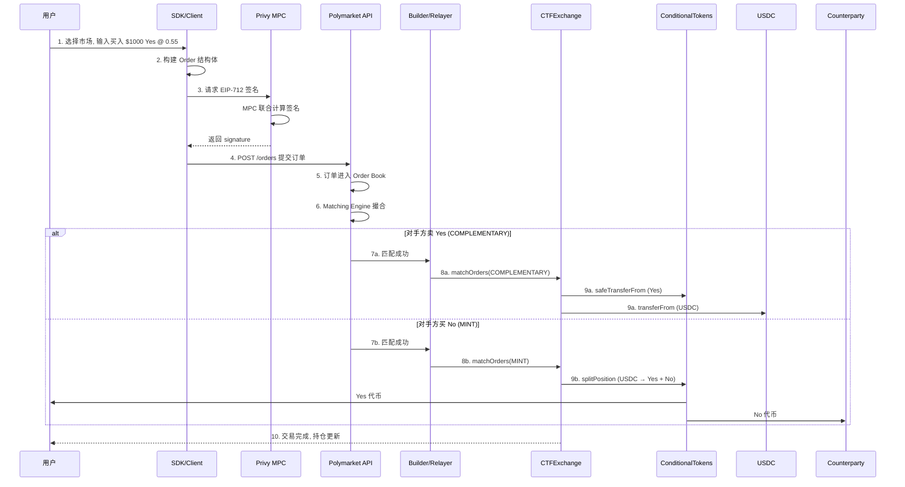
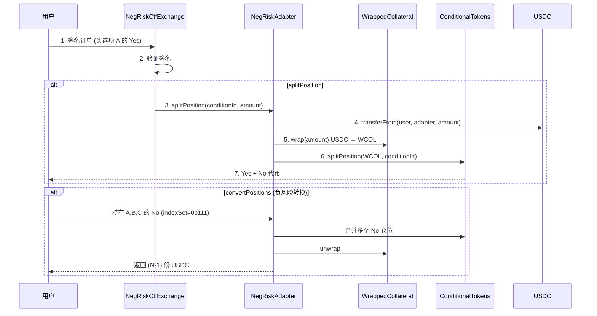
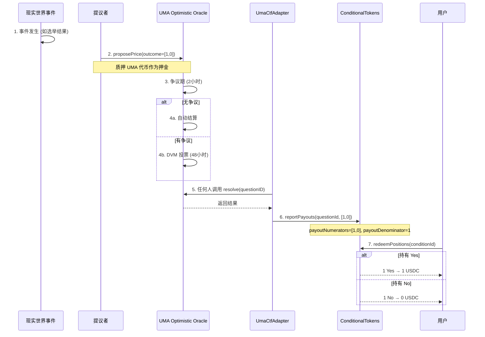
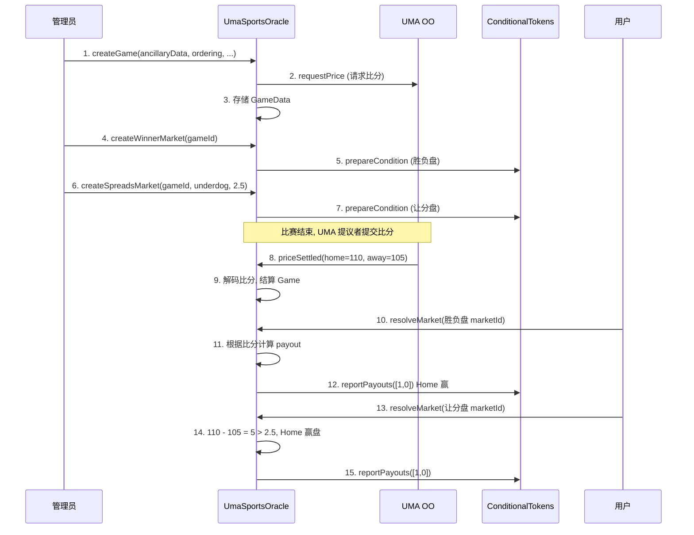
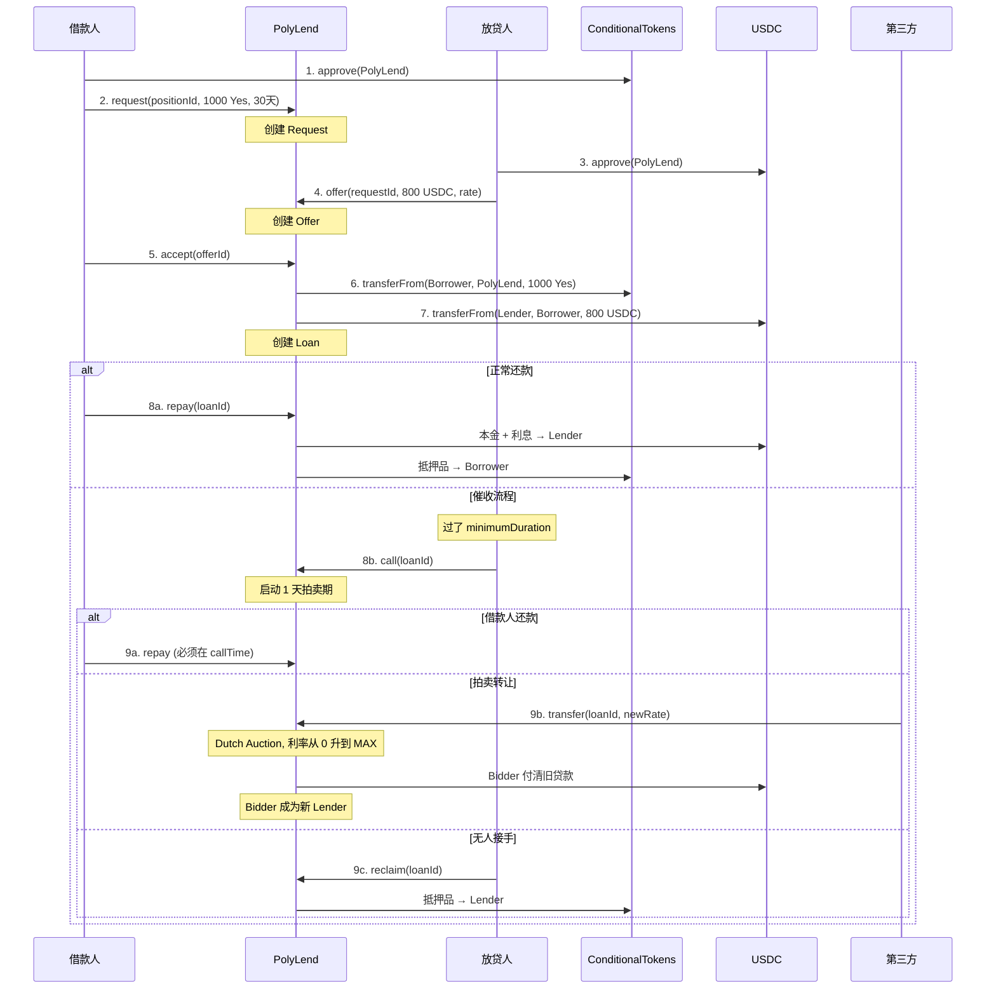
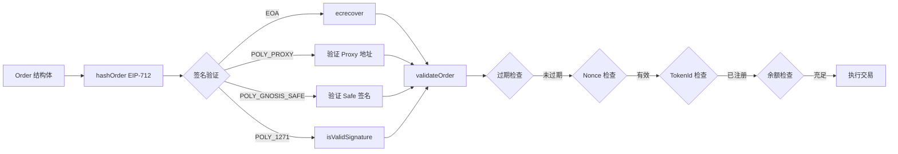
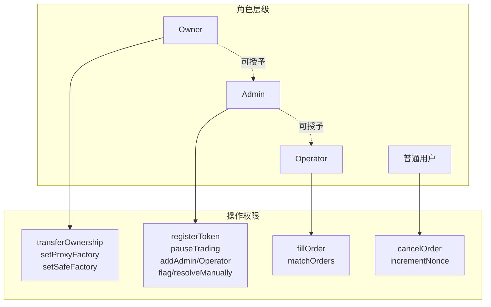

# Polymarket 智能合约架构总览

## 1. 模块架构总图


```
┌─────────────────────────────────────────────────────────────────────────────────────────────────────────────────────────────────────────────────────────────────┐
│                                                              外 部 系 统 (External Systems)                                                                     │
├─────────────────────────────────────────┬───────────────────────────────────────────────────────────────────┬───────────────────────────────────────────────────┤
│           用户 EOA/Safe                 │                链下 Order Book (OffchainOB)                       │               Polymarket Relayer                  │
│  (持有 USDC / 签署 EIP-712 交易订单)    │  (订单撮合 / 价格发现 / 存储所有未成交的 Maker 订单数据)          │  (批量提交交易 / 代付 Gas / 运行 GSN 节点)        │
└───────────────────┬─────────────────────┴─────────────────────────────────┬─────────────────────────────────┴─────────────────────────────┬─────────────────────┘
                    │ approve() USDC                                        │ 撮合成功                                                      │ matchOrders()
                    │ setApprovalForAll() CTF                               │                                                               │
                    │ EIP-712 签名订单                                      ▼                                                               │
                    │                                              [Relayer 接收]                                                           │
                    ▼                                                                                                                       ▼
┌─────────────────────────────────────────────────────────────────────────────────────────────────────────────────────────────────────────────────────────────────┐
│                                                              Polygon PoS 链上合约                                                                               │
│ ┌─────────────────────────────────────────────────────────────────────────────────────────────────────────────────────────────────────────────────────────────┐ │
│ │                                                         第三方合约 (非 Polymarket)                                                                          │ │
│ │ ┌────────────────────────────────────────┐  ┌─────────────────────────────────────────────────┐  ┌────────────────────────────────────────────────────────┐ │ │
│ │ │ USDC (ERC20 抵押品)                    │  │ UMA OO V2 (Optimistic Oracle)                   │  │ Gnosis Safe (多签钱包框架)                             │ │ │
│ │ │ 0x2791Bca1f2de...                      │  │ requestPrice(id, time, data)                    │  │                                                        │ │ │
│ │ │ 所有交易的基准支付货币                 │  │ settle(id, time, data)                          │  │                                                        │ │ │
│ │ │                                        │  │ 争议期 2h -> DVM 投票                           │  │                                                        │ │ │
│ │ └────────────────────────────────────────┘  └─────────────────────────────────────────────────┘  └────────────────────────────────────────────────────────┘ │ │
│ └─────────────────────────────────────────────────────────────────────────────────────────────────────────────────────────────────────────────────────────────┘ │
│ ┌─────────────────────────────────────────────────────────────────────────────────────────────────────────────────────────────────────────────────────────────┐ │
│ │                                                         钱包工厂层 (Wallet Layer)                                                                           │ │
│ │ ┌─────────────────────────────────────────────────────────────┐  ┌───────────────────────────────────────────────────────────────────────────────────────┐  │ │
│ │ │ SafeProxyFactory                                            │  │ ProxyWalletFactory                                                                    │  │ │
│ │ ├─────────────────────────────────────────────────────────────┤  ├───────────────────────────────────────────────────────────────────────────────────────┤  │ │
│ │ │ createProxy(sig) -> Safe                                    │  │ proxy(calls[]) 批量执行                                                               │  │ │
│ │ │ computeProxyAddress(user)                                   │  │ makeWallet() Create2 克隆                                                             │  │ │
│ │ │ OUT: Gnosis Safe 实例                                       │  │ setGSNModule() [Owner]                                                                │  │ │
│ │ │         │ 部署                                              │  │ OUT: ProxyWallet 实例 / GSN 代付 Gas                                                  │  │ │
│ │ │         └──────> [Gnosis Safe]                              │  │                                                                                       │  │ │
│ │ └─────────────────────────────────────────────────────────────┘  └───────────────────────────────────────────────────────────────────────────────────────┘  │ │
│ └─────────────────────────────────────────────────────────────────────────────────────────────────────────────────────────────────────────────────────────────┘ │
│ ┌─────────────────────────────────────────────────────────────────────────────────────────────────────────────────────────────────────────────────────────────┐ │
│ │                                                         交易层 (Exchange Layer)                                                                             │ │
│ │ ┌──────────────────────────────────────────────────────────────────────────┐  ┌─────────────────────────────────────────────────────────────────────────┐   │ │
│ │ │ CTFExchange (0x4bFb41d5B3570DeFd03C39...)                                │  │ NegRiskCtfExchange (0xC5d563A36AE78145C45a50...)                        │   │ │
│ │ ├──────────────────────────────────────────────────────────────────────────┤  ├─────────────────────────────────────────────────────────────────────────┤   │ │
│ │ │ IN: Order + Signature                                                    │  │ 继承 CTFExchange 全部接口                                               │   │ │
│ │ │ fillOrder(order, amt) [Operator]                                         │  │ 多选市场专用 (One-of-Many Markets)                                      │   │ │
│ │ │ fillOrders(orders[], amts[]) [Operator]                                  │  │ 构造时授权 NegRiskAdapter                                               │   │ │
│ │ │ matchOrders(taker, makers[]) [Operator]                                  │  │         │ 委托所有操作                                                  │   │ │
│ │ │    ├─ COMPLEMENTARY: YES <-> USDC                                        │  │         └──────────────────────────────────────────────────> [Adapter]  │   │ │
│ │ │    ├─ MINT: 2买单 -> splitPosition()                                     │  └─────────────────────────────────────────────────────────────────────────┘   │ │
│ │ │    └─ MERGE: 2卖单 -> mergePositions()                                   │  ┌─────────────────────────────────────────────────────────────────────────┐   │ │
│ │ │ cancelOrder(order) [Maker]                                               │  │ FeeModule (协议费用模块)                                                │   │ │
│ │ │ incrementNonce() [User]                                                  │  ├─────────────────────────────────────────────────────────────────────────┤   │ │
│ │ │ registerToken(tokenId) [Admin]                                           │  │ IN: matchOrders 参数                                                    │   │ │
│ │ │ OUT: OrderFilled / OrderMatched 事件                                     │  │ matchOrders(...) [Admin] 代理调用 + 退还多付费                          │   │ │
│ │ │         │ splitPosition()                                                │  │ withdrawFees(to, tokenId, amt)                                          │   │ │
│ │ │         │ mergePositions()                                               │  │ OUT: refund = order.fee - actualFee                                     │   │ │
│ │ │         │ transferFrom() USDC                                            │  │         │ matchOrders() 代理                                            │   │ │
│ │ │         │ safeTransferFrom() CTF                                         │  │         └──────────────────────────────────────────────> [CTFExchange]  │   │ │
│ │ │         ▼                                                                │  └─────────────────────────────────────────────────────────────────────────┘   │ │
│ │ └──────────────────────────────────────────────────────────────────────────┘                                                                                │ │
│ └───────────────────────────────────────────────│─────────────────────────────────────────────────────────────────────────────────────────────────────────────┘ │
│ ┌───────────────────────────────────────────────│─────────────────────────────────────────────────────────────────────────────────────────────────────────────┐ │
│ │                                               ▼   核心资产层 (Core Layer)                                                                                   │ │
│ │ ┌──────────────────────────────────────────────────────────────────────────┐  ┌─────────────────────────────────────────────────────────────────────────┐   │ │
│ │ │ ConditionalTokens (Gnosis CTF) 0x4D97DCd97eC945f40cF65...                │  │ NegRiskAdapter (0xd91E80cF2E7be2e162c651...)                            │   │ │
│ │ ├──────────────────────────────────────────────────────────────────────────┤  ├─────────────────────────────────────────────────────────────────────────┤   │ │
│ │ │ IN: collateral, conditionId, partition                                   │  │ IN: marketId, conditionId, amount                                       │   │ │
│ │ │ prepareCondition(oracle, qId, slots) -> conditionId                      │  │ prepareMarket(feeBips, data) [Admin]                                    │   │ │
│ │ │ splitPosition(col, parent, cond, part, amt) [USDC -> YES+NO]             │  │ prepareQuestion(mktId, data) [Admin]                                    │   │ │
│ │ │ mergePositions(col, parent, cond, part, amt) [YES+NO -> USDC]            │  │ splitPosition(condId, amt) [User]                                       │   │ │
│ │ │ redeemPositions(col, parent, cond, sets) [结算后赎回]                    │  │ mergePositions(condId, amt) [User]                                      │   │ │
│ │ │ reportPayouts(qId, payouts[]) [Oracle Only]                              │  │ convertPositions(mktId, indexSet, amt) [负风险转换: 多NO -> USDC]       │   │ │
│ │ │ STATE: payoutNumerators / payoutDenominator                              │  │ reportOutcome(qId, outcome) [Oracle]                                    │   │ │
│ │ │ OUT: ERC1155 positionId                                                  │  │ OUT: 转换后 USDC/代币                                                   │   │ │
│ │ │         ^                                                                │  │         │ splitPosition() / mergePositions()                            │   │ │
│ │ │         │ reportPayouts()                                                │  │         │ wrap() / unwrap()                                             │   │ │
│ │ │         │                                                                │  │         ▼                                                               │   │ │
│ │ └──────────────────────────────────────────────────────────────────────────┘  └─────────────────────────────────────────────────────────────────────────┘   │ │
│ │                                                                               ┌─────────────────────────────────────────────────────────────────────────┐   │ │
│ │                                                                               │ WrappedCollateral (WCOL)                                                │   │ │
│ │                                                                               ├─────────────────────────────────────────────────────────────────────────┤   │ │
│ │                                                                               │ wrap(amt) USDC -> WCOL (1:1)                                            │   │ │
│ │                                                                               │ unwrap(amt) WCOL -> USDC (1:1)                                          │   │ │
│ │                                                                               │ OUT: WCOL ERC20                                                         │   │ │
│ │                                                                               │ underlying = USDC                                                       │   │ │
│ │                                                                               │         │ transferFrom() USDC                                           │   │ │
│ │                                                                               │         └────────────────────────────────────────────────────> [USDC]   │   │ │
│ │                                                                               └─────────────────────────────────────────────────────────────────────────┘   │ │
│ └─────────────────────────────────────────────────────────────────────────────────────────────────────────────────────────────────────────────────────────────┘ │
│ ┌─────────────────────────────────────────────────────────────────────────────────────────────────────────────────────────────────────────────────────────────┐ │
│ │                                                         预言机层 (Oracle Layer)                                                                             │ │
│ │ ┌──────────────────────────────────────────────────────────────────────────┐  ┌─────────────────────────────────────────────────────────────────────────┐   │ │
│ │ │ UmaCtfAdapter (核心适配器)                                               │  │ NegRiskOperator (多选市场操作员)                                        │   │ │
│ │ ├──────────────────────────────────────────────────────────────────────────┤  ├─────────────────────────────────────────────────────────────────────────┤   │ │
│ │ │ IN: questionId, ancillaryData                                            │  │ IN: requestId (来自 UmaAdapter)                                         │   │ │
│ │ │ initialize(data, token, reward, bond, live) [创建问题]                   │  │ setOracle(addr) [Admin, 仅一次]                                         │   │ │
│ │ │ ready(qId) -> bool [View]                                                │  │ prepareMarket(feeBips, data) [Admin]                                    │   │ │
│ │ │ resolve(qId) [Anyone] -> CTF.reportPayouts                               │  │ prepareQuestion(mktId, data, reqId) [Admin]                             │   │ │
│ │ │ flag(qId) [Admin]                                                        │  │ reportPayouts(reqId, payouts[]) [Oracle]                                │   │ │
│ │ │ resolveManually(qId, payouts[]) [Admin]                                  │  │ resolveQuestion(qId) [Anyone]                                           │   │ │
│ │ │ reset(qId) [Admin]                                                       │  │ flagQuestion(qId) [Admin]                                               │   │ │
│ │ │ OUT: payouts [1,0]/[0,1]/[0.5,0.5]                                       │  │ emergencyResolveQuestion(qId, res) [Admin]                              │   │ │
│ │ │ OO返回: 1e18=YES, 0=NO, 0.5e18=平                                        │  │ OUT: -> NegRiskAdapter.reportOutcome                                    │   │ │
│ │ │         │ requestPrice() / settle()                                      │  │         │ reportOutcome()                                               │   │ │
│ │ │         │ reportPayouts() -> CTF                                         │  │         └────────────────────────────────────────────> [NegRiskAdapter] │   │ │
│ │ │         ▼                                                                │  │         ^ 结果来源                                                      │   │ │
│ │ │     [UMA OO V2]                                                          │  │         │                                                               │   │ │
│ │ └──────────────────────────────────────────────────────────────────────────┘  │     [UmaAdapter]                                                        │   │ │
│ │ ┌──────────────────────────────────────────────────────────────────────────┐  └─────────────────────────────────────────────────────────────────────────┘   │ │
│ │ │ UmaSportsOracle (体育专用预言机)                                         │                                                                                │ │
│ │ ├──────────────────────────────────────────────────────────────────────────┤                                                                                │ │
│ │ │ IN: gameId, ancillaryData                                                │                                                                                │ │
│ │ │ createGame(data, ordering, token, reward, bond, liveness) [Admin]        │                                                                                │ │
│ │ │ createWinnerMarket(gameId) [Admin]                                       │                                                                                │ │
│ │ │ createSpreadsMarket(gameId, underdog, line) [Admin]                      │                                                                                │ │
│ │ │ createTotalsMarket(gameId, line) [Admin]                                 │                                                                                │ │
│ │ │ resolveMarket(marketId) [Anyone]                                         │                                                                                │ │
│ │ │ OUT: 根据比分计算 payouts (Winner/Spreads/Totals)                        │                                                                                │ │
│ │ │         │ requestPrice() / priceSettled()                                │                                                                                │ │
│ │ │         │ prepareCondition() -> CTF                                      │                                                                                │ │
│ │ │         │ reportPayouts() -> CTF                                         │                                                                                │ │
│ │ │         ▼                                                                │                                                                                │ │
│ │ │     [UMA OO V2] / [CTF]                                                  │                                                                                │ │
│ │ └──────────────────────────────────────────────────────────────────────────┘                                                                                │ │
│ └─────────────────────────────────────────────────────────────────────────────────────────────────────────────────────────────────────────────────────────────┘ │
│ ┌─────────────────────────────────────────────────────────────────────────────────────────────────────────────────────────────────────────────────────────────┐ │
│ │                                                         扩展 DeFi 层                                                                                        │ │
│ │ ┌─────────────────────────────────────────────────────────────────────────────────────────────────────────────────────────────────────────────────────────┐ │ │
│ │ │ PolyLend (预测资产借贷协议)                                                                                                                             │ │ │
│ │ ├─────────────────────────────────────────────────────────────────────────────────────────────────────────────────────────────────────────────────────────┤ │ │
│ │ │ IN: positionId, USDC amount                                                                                                                             │ │ │
│ │ │ request(posId, colAmt, minDur) [Borrower] | offer(reqId, loanAmt, rate) [Lender] | accept(offerId) [Borrower]                                           │ │ │
│ │ │ repay(loanId, ts) [Borrower] | call(loanId) [Lender] | reclaim(loanId) [Lender] | transfer(loanId, newRate) [Bidder]                                    │ │ │
│ │ │ OUT: Loan 状态转换 | AUCTION_DURATION = 1天 | MAX_INTEREST ~ 1000% APY                                                                                  │ │ │
│ │ │         │ safeTransferFrom() CTF                                                                                                                        │ │ │
│ │ │         │ transferFrom() USDC                                                                                                                           │ │ │
│ │ │         └──────────────────────────────────────────────────────────────────────────────────────────────────────────> [CTF] / [USDC]                     │ │ │
│ │ └─────────────────────────────────────────────────────────────────────────────────────────────────────────────────────────────────────────────────────────┘ │ │
│ └─────────────────────────────────────────────────────────────────────────────────────────────────────────────────────────────────────────────────────────────┘ │
└─────────────────────────────────────────────────────────────────────────────────────────────────────────────────────────────────────────────────────────────────┘
```

---

## 2. 模块详细说明

### 2.1 核心资产层

#### ConditionalTokens (Gnosis CTF)

| 属性 | 值                                                                   |
| ---- | -------------------------------------------------------------------- |
| 地址 | `0x4D97DCd97eC945f40cF65F87097ACe5EA0476045`                         |
| 标准 | ERC1155                                                              |
| 源码 | [conditional-tokens-contracts.md](./conditional-tokens-contracts.md) |

**核心功能**: 条件代币的创建、拆分、合并、赎回

| 接口                                                                             | 输入                                 | 输出        | 说明            |
| -------------------------------------------------------------------------------- | ------------------------------------ | ----------- | --------------- |
| `prepareCondition(oracle, questionId, outcomeSlotCount)`                         | oracle地址, 问题ID, 结果数量         | conditionId | 创建新条件      |
| `splitPosition(collateral, parentCollectionId, conditionId, partition, amount)`  | 抵押品, 父集合ID, 条件ID, 分区, 数量 | -           | USDC → YES + NO |
| `mergePositions(collateral, parentCollectionId, conditionId, partition, amount)` | 同上                                 | -           | YES + NO → USDC |
| `redeemPositions(collateral, parentCollectionId, conditionId, indexSets)`        | 抵押品, 父集合ID, 条件ID, 索引集     | -           | 结算后赎回      |
| `reportPayouts(questionId, payouts[])`                                           | 问题ID, 赔付向量                     | -           | 仅 oracle 可调  |

**状态变量**: 

- `payoutNumerators[conditionId]` - 结果向量, 如 `[1,0]`=YES赢
- `payoutDenominator[conditionId]` - 非零表示已结算

---

### 2.2 交易层

#### CTFExchange

| 属性 | 值                                           |
| ---- | -------------------------------------------- |
| 地址 | `0x4bFb41d5B3570DeFd03C39a9A4D8dE6Bd8B8982E` |
| 源码 | [ctf-exchange.md](./ctf-exchange.md)         |

**核心功能**: 订单撮合、交易执行、代币注册

| 接口                                              | 权限     | 输入                              | 输出 | 说明         |
| ------------------------------------------------- | -------- | --------------------------------- | ---- | ------------ |
| `fillOrder(order, amount)`                        | Operator | 订单, 数量                        | -    | 执行单笔订单 |
| `fillOrders(orders[], amounts[])`                 | Operator | 订单数组, 数量数组                | -    | 批量执行     |
| `matchOrders(takerOrder, makerOrders[], ...)`     | Operator | Taker订单, Maker订单数组          | -    | 撮合交易     |
| `cancelOrder(order)`                              | Maker    | 订单                              | -    | 取消订单     |
| `registerToken(tokenId, complement, conditionId)` | Admin    | tokenId, 互补tokenId, conditionId | -    | 注册交易对   |

**MatchType 撮合类型**: 

- `COMPLEMENTARY` - 买 vs 卖, 直接交换
- `MINT` - 两个买单, 调 `CTF.splitPosition` 铸造 YES+NO
- `MERGE` - 两个卖单, 调 `CTF.mergePositions` 合并成 USDC

**SignatureType 签名类型**: 

- `EOA=0` - 普通外部账户
- `POLY_PROXY=1` - Polymarket 代理钱包
- `POLY_GNOSIS_SAFE=2` - Gnosis Safe 钱包
- `POLY_1271=3` - EIP-1271 合约签名

---

#### NegRiskCtfExchange

| 属性 | 值                                                   |
| ---- | ---------------------------------------------------- |
| 源码 | [neg-risk-ctf-adapter.md](./neg-risk-ctf-adapter.md) |

**说明**: CTFExchange 的薄封装, 构造时授权 NegRiskAdapter 操作 CTF, 继承 CTFExchange 所有功能。

---

#### FeeModule

| 属性 | 值                                                 |
| ---- | -------------------------------------------------- |
| 源码 | [exchange-fee-module.md](./exchange-fee-module.md) |

**核心功能**: 代理 CTFExchange 并处理手续费退款

| 接口                                | 权限  | 说明                                         |
| ----------------------------------- | ----- | -------------------------------------------- |
| `matchOrders(...)`                  | Admin | 调用 exchange.matchOrders() + 退还多付手续费 |
| `withdrawFees(to, tokenId, amount)` | Admin | 提取手续费 (tokenId=0 为 USDC)               |

**退款逻辑**: 

```
exchangeFee = order.feeRateBps 计算出的费用
operatorFee = operator 实际收取的费用
refund = exchangeFee - operatorFee (如果 > 0)
```

---

### 2.3 多选市场 (NegRisk)

#### NegRiskAdapter

| 属性 | 值                                                   |
| ---- | ---------------------------------------------------- |
| 地址 | `0xd91E80cF2E7be2e162c6513ceD06f1dD0dA35296`         |
| 源码 | [neg-risk-ctf-adapter.md](./neg-risk-ctf-adapter.md) |

**核心功能**: 多选一市场的 CTF 适配器, 支持"负风险"转换

| 接口                                           | 权限   | 输入                 | 说明                      |
| ---------------------------------------------- | ------ | -------------------- | ------------------------- |
| `prepareMarket(feeBips, metadata)`             | Admin  | 费率, 元数据         | 创建多选一市场            |
| `prepareQuestion(marketId, metadata)`          | Admin  | 市场ID, 元数据       | 在市场下添加选项          |
| `reportOutcome(questionId, outcome)`           | Oracle | 问题ID, 结果         | 报告问题结果              |
| `splitPosition(conditionId, amount)`           | 用户   | 条件ID, 数量         | USDC → YES + NO           |
| `mergePositions(conditionId, amount)`          | 用户   | 条件ID, 数量         | YES + NO → USDC           |
| `convertPositions(marketId, indexSet, amount)` | 用户   | 市场ID, 索引集, 数量 | **核心特性: NO 仓位转换** |

**convertPositions 负风险转换**: 

```
持有选项 A,B,C 的 NO, indexSet=0b111
转换后得到: 2 份 USDC (因为 3-1=2)
这就是"负风险"名称的由来
```

---

#### NegRiskOperator

| 属性 | 值                                                   |
| ---- | ---------------------------------------------------- |
| 源码 | [neg-risk-ctf-adapter.md](./neg-risk-ctf-adapter.md) |

**核心功能**: Oracle 中间层, 接收 UMA 结果并推送到 NegRiskAdapter

| 接口                                           | 权限   | 说明                        |
| ---------------------------------------------- | ------ | --------------------------- |
| `setOracle(addr)`                              | Admin  | 设置 oracle (仅一次)        |
| `prepareMarket(feeBips, data)`                 | Admin  | 创建市场                    |
| `prepareQuestion(marketId, data, requestId)`   | Admin  | 添加问题, 关联 UMA 请求     |
| `reportPayouts(requestId, payouts[])`          | Oracle | UMA adapter 回调            |
| `resolveQuestion(questionId)`                  | 任何人 | 将结果推送到 NegRiskAdapter |
| `flagQuestion(questionId)`                     | Admin  | 标记问题, 阻止自动解析      |
| `emergencyResolveQuestion(questionId, result)` | Admin  | 紧急手动解析                |

---

### 2.4 预言机层

#### UmaCtfAdapter

| 属性 | 值                                         |
| ---- | ------------------------------------------ |
| 源码 | [uma-ctf-adapter.md](./uma-ctf-adapter.md) |

**核心功能**: 连接 UMA Optimistic Oracle 和 ConditionalTokens

| 接口                                                                     | 权限   | 输入                                   | 说明                 |
| ------------------------------------------------------------------------ | ------ | -------------------------------------- | -------------------- |
| `initialize(ancillaryData, rewardToken, reward, proposalBond, liveness)` | Admin  | 附加数据, 奖励代币, 奖励, 押金, 活跃期 | 创建问题             |
| `resolve(questionID)`                                                    | 任何人 | 问题ID                                 | 从 OO 拉取结果并解析 |
| `ready(questionID)`                                                      | View   | 问题ID                                 | OO 结果是否就绪      |
| `flag(questionID)`                                                       | Admin  | 问题ID                                 | 标记需手动解析       |
| `resolveManually(questionID, payouts[])`                                 | Admin  | 问题ID, 赔付向量                       | 手动解析             |
| `reset(questionID)`                                                      | Admin  | 问题ID                                 | 重置并重新请求价格   |

**OO 返回值解析**: 

- `1e18` = YES 赢
- `0` = NO 赢
- `0.5e18` = 平局

---

#### UmaSportsOracle

| 属性 | 值                                             |
| ---- | ---------------------------------------------- |
| 源码 | [uma-sports-oracle.md](./uma-sports-oracle.md) |

**核心功能**: 体育赛事预言机, 支持胜负盘、让分盘、大小盘

| 接口                                                                 | 权限   | 说明             |
| -------------------------------------------------------------------- | ------ | ---------------- |
| `createGame(ancillaryData, ordering, token, reward, bond, liveness)` | Admin  | 创建比赛         |
| `createWinnerMarket(gameId)`                                         | Admin  | 创建胜负盘       |
| `createSpreadsMarket(gameId, underdog, line)`                        | Admin  | 创建让分盘       |
| `createTotalsMarket(gameId, line)`                                   | Admin  | 创建大小盘       |
| `resolveMarket(marketId)`                                            | 任何人 | 使用比分解析市场 |

**MarketType**: 

- `Winner` - 胜负盘
- `Spreads` - 让分盘 (line 必须是半点, 如 2.5)
- `Totals` - 大小盘

**GameState**: `Created → Paused → Settled/Canceled/EmergencySettled`

---

### 2.5 用户钱包层

#### SafeProxyFactory

| 属性 | 值                                   |
| ---- | ------------------------------------ |
| 源码 | [safe-factory.md](./safe-factory.md) |

**核心功能**: 用 EIP-712 签名创建 Gnosis Safe 钱包

| 接口                                                             | 输入                         | 输出       | 说明                           |
| ---------------------------------------------------------------- | ---------------------------- | ---------- | ------------------------------ |
| `createProxy(paymentToken, payment, paymentReceiver, createSig)` | 支付代币, 金额, 接收者, 签名 | proxy 地址 | 从签名恢复 owner, Create2 部署 |
| `computeProxyAddress(user)`                                      | 用户地址                     | proxy 地址 | 预计算地址 (不部署)            |

**Safe 初始化参数**: 

- owners: `[owner]`
- threshold: `1`
- fallbackHandler: 配置的 handler

---

#### ProxyWalletFactory

| 属性 | 值                                     |
| ---- | -------------------------------------- |
| 源码 | [proxy-factory.md](./proxy-factory.md) |

**核心功能**: 代理钱包工厂, 支持 GSN 代付 gas

| 接口                                     | 说明                                            |
| ---------------------------------------- | ----------------------------------------------- |
| `proxy(ProxyCall[] calls)`               | 通过 GSN relayer 执行批量调用, 无钱包则自动创建 |
| `makeWallet(_implementation, msgSender)` | Create2 克隆创建用户钱包                        |
| `setGSNModule(gsnModule)`                | 更新 GSN 模块 (onlyOwner)                       |

---

### 2.6 扩展 DeFi 层

#### PolyLend

| 属性 | 值                             |
| ---- | ------------------------------ |
| 源码 | [poly-lend.md](./poly-lend.md) |

**核心功能**: 用 YES/NO token 作抵押借 USDC

| 接口                                                     | 角色   | 说明                     |
| -------------------------------------------------------- | ------ | ------------------------ |
| `request(positionId, collateralAmount, minimumDuration)` | 借款人 | 发起借款请求             |
| `offer(requestId, loanAmount, rate)`                     | 放贷人 | 对请求报价               |
| `accept(offerId)`                                        | 借款人 | 接受报价, 抵押品转入合约 |
| `repay(loanId, repayTimestamp)`                          | 借款人 | 还款 (本金 + 利息)       |
| `call(loanId)`                                           | 放贷人 | 催收, 启动 1 天拍卖期    |
| `reclaim(loanId)`                                        | 放贷人 | 拍卖结束后收走抵押品     |
| `transfer(loanId, newRate)`                              | 第三方 | Dutch Auction 贷款转让   |

**关键常量**: 

- `MAX_INTEREST` ≈ 1000% APY
- `AUCTION_DURATION` = 1 天
- `PAYBACK_BUFFER` = 1 分钟

---

## 3. 核心业务流程图

### 3.1 二元市场交易流程



### 3.2 多选市场 (NegRisk) 交易流程



### 3.3 市场结算流程 (UMA)



### 3.4 体育市场流程



### 3.5 借贷流程 (PolyLend)



---

## 4. 关键数据流

### 4.1 tokenId 计算链

```
                        prepareCondition
(oracle, questionId, outcomeSlotCount) ────────────────► conditionId
                                                              │
                                                              │ + parentCollectionId + indexSet
                                                              ▼
                                                         collectionId
                                                              │
                                                              │ + collateralToken
                                                              ▼
                                                         positionId (ERC1155 tokenId)
```

**计算公式**: 

```solidity
conditionId = keccak256(oracle, questionId, outcomeSlotCount)
collectionId = CTHelpers.getCollectionId(parentCollectionId, conditionId, indexSet)
positionId = keccak256(collateralToken, collectionId)
```

**Polymarket 简化**: 

- `outcomeSlotCount` 固定为 2 (YES/NO)
- `parentCollectionId` 固定为 bytes32(0)
- `indexSet`: YES=1 (0b01), NO=2 (0b10)

### 4.2 订单验证链



### 4.3 Order 结构体

```solidity
struct Order {
    uint256 salt;           // 随机数, 确保唯一性
    address maker;          // 挂单方地址
    address signer;         // 签名者 (可以是 maker 或授权的 signer)
    address taker;          // 吃单方 (0x0 表示任何人)
    uint256 tokenId;        // CTF 代币 ID
    uint256 makerAmount;    // maker 提供的数量
    uint256 takerAmount;    // taker 提供的数量
    uint256 expiration;     // 过期时间戳
    uint256 nonce;          // 用于批量取消
    uint256 feeRateBps;     // 手续费率 (basis points)
    uint8 side;             // 0=BUY, 1=SELL
    uint8 signatureType;    // 签名类型
}
```

### 4.4 手续费计算

```
price = makerAmount / takerAmount (或反向, 取决于 side)
surcharge = min(price, 1 - price)  // 越接近 0.5 费率越高

BUY:  fee = feeRateBps * surcharge * (tokens / price) / 10000
SELL: fee = feeRateBps * surcharge * tokens / 10000
```

---

## 5. 合约地址汇总 (Polygon Mainnet)

| 合约              | 地址                                         |
| ----------------- | -------------------------------------------- |
| ConditionalTokens | `0x4D97DCd97eC945f40cF65F87097ACe5EA0476045` |
| CTFExchange       | `0x4bFb41d5B3570DeFd03C39a9A4D8dE6Bd8B8982E` |
| NegRiskAdapter    | `0xd91E80cF2E7be2e162c6513ceD06f1dD0dA35296` |
| NegRiskExchange   | `0xC5d563A36AE78145C45a50134d48A1215220f80a` |
| USDC              | `0x2791Bca1f2de4661ED88A30C99A7a9449Aa84174` |

---

## 6. 角色权限模型



---

## 7. 子模块文档索引

| 模块               | 文档                                                                 | 说明                 |
| ------------------ | -------------------------------------------------------------------- | -------------------- |
| ConditionalTokens  | [conditional-tokens-contracts.md](./conditional-tokens-contracts.md) | Gnosis CTF 核心合约  |
| CTFExchange        | [ctf-exchange.md](./ctf-exchange.md)                                 | 二元市场交易所       |
| FeeModule          | [exchange-fee-module.md](./exchange-fee-module.md)                   | 手续费代理模块       |
| NegRiskAdapter     | [neg-risk-ctf-adapter.md](./neg-risk-ctf-adapter.md)                 | 多选市场适配器       |
| UmaCtfAdapter      | [uma-ctf-adapter.md](./uma-ctf-adapter.md)                           | UMA 预言机适配器     |
| UmaSportsOracle    | [uma-sports-oracle.md](./uma-sports-oracle.md)                       | 体育赛事预言机       |
| PolyLend           | [poly-lend.md](./poly-lend.md)                                       | 条件代币借贷协议     |
| SafeProxyFactory   | [safe-factory.md](./safe-factory.md)                                 | Gnosis Safe 钱包工厂 |
| ProxyWalletFactory | [proxy-factory.md](./proxy-factory.md)                               | 代理钱包工厂         |
